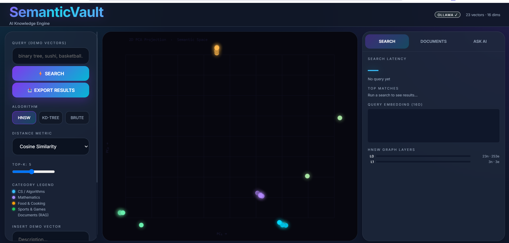
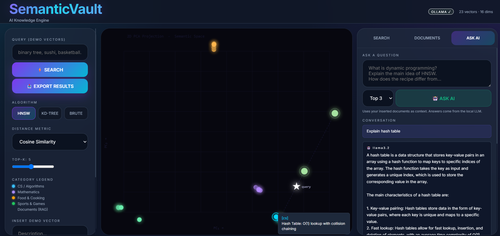
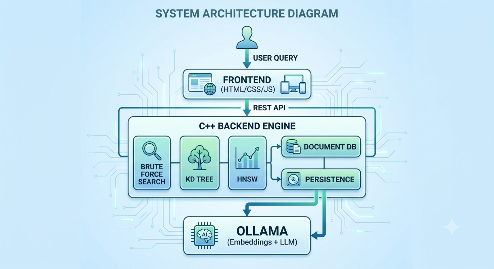

# SemanticVault — AI-Powered Semantic Search & RAG Engine

SemanticVault is a high-performance semantic search engine and Retrieval-Augmented Generation (RAG) system built from scratch using **C++**, custom **vector indexing algorithms**, and **local LLM inference with Ollama**.

It enables users to ingest documents, generate vector embeddings, perform approximate nearest neighbor (ANN) search, and query documents using natural language through a local AI assistant.

---

## 🚀 Features

- ⚡ Custom **Vector Database Engine** built in C++
- 🔍 Multiple search algorithms:
  - **HNSW (Hierarchical Navigable Small World)**
  - **KD-Tree**
  - **Brute Force Search**
- 🧠 Semantic similarity search using embeddings
- 📄 PDF and text document ingestion
- 🤖 Retrieval-Augmented Generation (RAG)
- 🧩 Local LLM inference using **Ollama + Llama 3.2**
- 📊 Interactive 2D vector visualization (PCA projection)
- 💾 Persistent document storage
- 📈 Benchmarking and algorithm comparison
- 🌐 Full REST API with modern frontend UI

---

## Problem Statement

Traditional keyword search struggles to understand semantic meaning.

For example:

- “binary tree”
- “tree traversal”
- “graph search”

Keyword-based systems treat these as unrelated text unless exact words match.

SemanticVault solves this problem by:

1. Converting text into embeddings
2. Storing vectors efficiently
3. Retrieving semantically similar vectors
4. Using retrieved context for AI-powered answers

This enables meaning-aware retrieval instead of simple keyword matching.

---

## Screenshots

### Main Dashboard


### RAG Question Answering


### System Architecture


---

## System Architecture

```text
User Query
   ↓
Frontend (HTML/CSS/JS)
   ↓ REST API
C++ Backend Engine
   ├── Brute Force Search
   ├── KD Tree
   ├── HNSW ANN Search
   ├── Document Database
   └── Persistence Layer
           ↓
        Ollama
   ├── Embeddings Model
   └── LLM Generation
```

---

## Tech Stack

### Backend
- C++17
- cpp-httplib
- STL Data Structures
- Multithreading (mutex)

### AI / ML
- Ollama
- Llama 3.2
- Nomic Embed Text
- PCA Projection

### Frontend
- HTML
- CSS
- JavaScript
- Canvas API

---

## Core Components

### 1. Vector Database Engine

Custom-built vector storage engine supporting:

- insertion
- deletion
- nearest-neighbor search
- similarity benchmarking

Supported distance metrics:

- Cosine Similarity
- Euclidean Distance
- Manhattan Distance
- Dot Product

---

### 2. HNSW Index

Implemented **Hierarchical Navigable Small World graph** for efficient ANN retrieval.

Benefits:

- logarithmic search complexity (approx.)
- scalable to large vector datasets
- significantly faster than brute force

---

### 3. KD-Tree

Implemented KD-tree for multi-dimensional partitioning.

Useful for:
- low-dimensional nearest-neighbor search
- benchmark comparison

---

### 4. Brute Force Search

Baseline exact nearest-neighbor search.

Used for:

- correctness verification
- performance benchmarking

Time Complexity:

```text
O(N × D)
```

---

### 5. Document Database

Document ingestion pipeline:

1. Upload PDF / text
2. Chunk text into segments
3. Generate embeddings
4. Store embeddings in vector DB

---

### 6. RAG Pipeline

Retrieval-Augmented Generation workflow:

```text
Question
   ↓
Generate Query Embedding
   ↓
Retrieve Top-K Relevant Chunks
   ↓
Construct Prompt
   ↓
Send to LLM
   ↓
Generate Final Answer
```

---

## Project Structure

```text
SemanticVault/
│
├── backend/
│   ├── main.cpp
│   ├── httplib.h
│   └── db.exe
│
├── frontend/
│   ├── index.html
│   ├── style.css
│   └── app.js
│
├── data/
│   ├── documents.db
│   └── documents.json
│
├── assets/
│   ├── ui-home.png
│   ├── rag-demo.png
│   └── architecture.png
│
├── README.md
└── .gitignore
`````````

---

## Installation

### 1. Clone repository

```bash
git clone https://github.com/YOUR_USERNAME/SemanticVault.git
cd SemanticVault
```

---

### 2. Install Ollama

Download:

https://ollama.com

Install required models:

```bash
ollama pull llama3.2
ollama pull nomic-embed-text
```

Run server:

```bash
ollama serve
```

---

### 3. Build backend

Windows (MinGW):

```bash
g++ -std=c++17 -O2 backend/main.cpp -o backend/db.exe -lws2_32
```

---

### 4. Run application

```bash
cd backend
./db.exe
```

Open browser:

```text
http://localhost:9090
```

---

## Performance

Approximate benchmark results:

| Algorithm | Complexity | Speed |
|---|---|---|
| Brute Force | O(N×D) | Slow |
| KD-Tree | ~O(log N) | Medium |
| HNSW | Approx. Logarithmic | Fast |

HNSW consistently outperformed brute force for larger datasets.

---

## Future Improvements

- FAISS integration
- GPU acceleration
- Better reranking
- Cloud deployment
- User authentication
- Distributed vector storage
- Production-scale indexing

---

## Key Learnings

Through this project, I gained hands-on experience with:

- Approximate Nearest Neighbor Search
- Vector Databases
- Retrieval-Augmented Generation
- LLM integration
- Semantic Search
- Backend system design
- Full-stack AI application development

---

## Author

**Aryan Upadhyay**

CSE (AI) Student | AI/ML & Software Engineering Enthusiast

GitHub: https://github.com/Aryanupadhyay1001